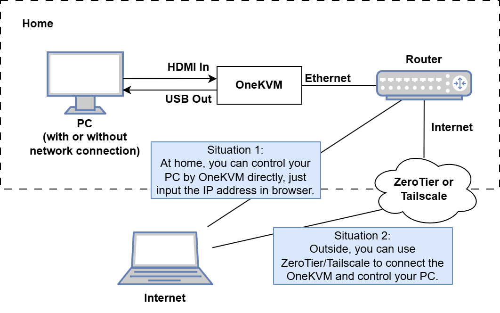

# Welcome to use OneKVM!

??? tip "Copyright statement"
    OneKVM is an [open-source firmware](https://github.com/mofeng-git/One-KVM) by GPL-3.0 license. We used it for our hardware project, and here is the documentation.

## What is OneKVM?

If you work remotely or frequently use remote software such as TeamViewer, it's time to purchase a OneKVM as a backup. When there are some problems with the computer (which often happens and there are always bugs), if you are not around the computer, things will become very awkward.

At the same time, if you are a data center operator or engaged in related work, why not consider purchasing a OneKVM for hardware remote control, so that you will not lose control of remote devices in the face of any possible accidents.

## Get started

Once you received the hardware, you can follow the steps below to get started:

1. Connect the network cable to the LAN port of the router, make sure the network is available.
2. Plug in the power adapter.
3. Connect the `HDMI Out` cable to the monitor, and you can see the ip address on the screen.
4. Open the browser and visit the ip address, you will see the login page.
5. Use the `admin` / `admin` for default to login, and you can start to use it.
6. Connect the `HDMI In` and `USB Out` cable to which you want to control, then back to the browser.

